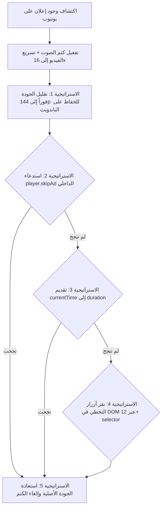

<div align="center">

# 🎬 WatchSmart

**إضافة متصفح كروم المتقدمة للتحكم الفائق في تشغيل الفيديو والتخطي الذكي للإعلانات**
*Advanced Video Playback Control & Smart Multi-Layer Ad Handling Chrome Extension (Manifest V3)*

[](https://developer.chrome.com/docs/extensions/mv3/intro/)
[](LICENSE)
[](#)
[](#)

</div>

---

## 📌 نبذة عن المشروع (Project Overview)

**WatchSmart** هي إضافة لمتصفح جوجل كروم متوافقة تماماً مع **Manifest V3**، مصممة لتوفير تجربة مشاهدة سلسة وفائقة للتحكم في مقاطع الفيديو عبر الإنترنت (وخاصة منصة **YouTube**). 

تتميز الإضافة بنظام متطور ومُتعدد الطبقات للتخطي الآلي للإعلانات وسريع الاستجابة بدون الحاجة لحظر الشبكة، إلى جانب أدوات تحكم مرنة وسريعة في سرعة التشغيل ومؤشرات مرئية تظهر فوق مشغل الفيديو (Heads-Up Display - HUD).

---

## 🚀 المميزات الرئيسية (Key Features)

### 1. 🛡️ نظام التخطي الذكي للإعلانات عبر 5 استراتيجيات متكاملة (Multi-Layer Smart Ad Handling)
يعمل النظام على التخلص من الإعلانات بسرعة خيالية تقارب الصفر ثانية وتوفير استهلاك الباندويث عبر تسلسل ذكي:

- **الاستراتيجية الأولى (S1 - Quality Drop to 144p):** بمجرد اكتشاف إعلان، يتم خفض جودة الإعلان فوراً إلى `144p` (`tiny`) لحفظ حتى 95% من استهلاك شبكة الإنترنت أثناء الإعلان.
- **الاستراتيجية الثانية (S2 - Native Player API):** استدعاء دالة التخطي المباشرة من مشغل يوتيوب الداخلي `player.skipAd()`.
- **الاستراتيجية الثالثة (S3 - Instant Time Jump):** تقديم وقت الفيديو فوراً إلى نهايته عبر ضبط `video.currentTime = video.duration`.
- **الاستراتيجية الرابعة (S4 - DOM Click Fallback):** فحص ومراقبة عناصر واجهة يوتيوب والتنفيذ الآلي للنقر فوراً على أكثر من 12 محدد لزر التخطي (`MutationObserver` + loop بفريم ريت 60fps).
- **الاستراتيجية الخامسة (S5 - Quality Restoration & Overlay Cleanup):** إزالة أي تراكيب إعلانية أو تنبيهات ومن ثم استعادة جودة التشغيل الأصلية تلقائياً بمجرد انتهاء الإعلان.
- **⚡ التسريع والمكتشفيات الإضافية:** تسريع الإعلان إلى `16x` وكتم الصوت تلقائياً أثناء الإعلان مع حظر محاولات السكربتات الأخرى لاكتشاف أدوات حظر الإعلانات (`Event Interception`).

### 2. ⚡ التحكم المتطور في السرعة وتشغيل الفيديو (Playback & Speed Controls)
- **مؤشر HUD تفاعلي (Heads-Up Display):** عرض شريط مؤشر مميز وعصري فوق الفيديو يوضح السرعة الحالية عند التغيير.
- **اختصارات شاشة ومفتاح سرعة مخصص:** إمكانية تعديل خطوة زيادة/نقصان السرعة بدقة عالية.
- **تأكيد السرعة ومنع التلاعب (Anti-Cheat):** محرك فحص وحماية يمنع المواقع من إعادة تعيين سرعة الفيديو رغماً عن المستخدم.

### 3. 🌐 الواجهة والدعم متعدد اللغات (UI & Preferences)
- **دعم اللغة العربية والإنجليزية (i18n):** واجهة مستخدم مترجمة بالكامل حسب لغة المتصفح.
- **تصميم ليلي أنيق (Dark Mode):** واجهة نافذة منبثقة (Popup) حديثة زجاجية وتفاعلية.
- **حفظ الإعدادات الفوري:** مزامنة لحظية للإعدادات باستخدام `chrome.storage.local`.

---

## 📐 مخطط عمل استراتيجيات تخطي الإعلانات (Execution Flowchart)



---

## 🏗️ البنية المعمارية وهيكلية المشروع (Project Architecture)

يعتمد المشروع على تقنية الفصل بين البيئات (**Split-Context Design**) لضمان أقصى أداء وأمان وفقاً لمعايير **Manifest V3**:

```
WatchSmart/
├── dist/                          # المخرجات النهائيّة للإنتاج (Compiled Bundle)
├── src/
│   ├── background/               # سكربت الخفية للعمليات الممتدة
│   │   └── background.js
│   ├── content/
│   │   ├── isolated/             # بيئة المحتوى المعزولة (Chrome APIs, Storage & Shortcuts)
│   │   │   ├── core.js           # قراءة وحفظ الإعدادات
│   │   │   ├── keyboard.js       # اختصارات لوحة المفاتيح
│   │   │   ├── wheel.js          # التحكم في السرعة بعجلة الماوس
│   │   │   ├── storage.js        # المزامنة مع chrome.storage
│   │   │   └── index.js
│   │   └── main/                 # البيئة الرئيسية (DOM & Player API Access)
│   │       ├── ad-detect.js      # محرك اكتشاف الإعلانات
│   │       ├── ad-skipper.js     # الاستراتيجيات الـ 5 للتخطي
│   │       ├── anti-cheat.js     # حماية السرعة ومنع التغيير القسري
│   │       ├── bridge.js         # جسر التواصل بين البيئة المعزولة والرئيسية (postMessage)
│   │       ├── hud.js            # شاشة العرض السريعة فوق الفيديو
│   │       ├── intercept.js     # اعتراض إنشاء مشغلات الفيديو والـ Events
│   │       ├── loop.js           # حلقة فحص 60fps عالية الأداء
│   │       ├── state.js          # إدارة حالة المشغل والسرعات
│   │       ├── tracker.js        # تتبع عناصر الفيديو في الصفحة
│   │       └── index.js
│   ├── popup/                    # النافذة المنبثقة للاعدادات (Popup UI)
│   │   ├── popup.html
│   │   ├── css/                  # التنسيقات والـ CSS
│   │   └── js/                   # منطق التحكم بالنافذة والترجمة (i18n)
│   └── manifest.json             # ملف تعريف الإضافة (Manifest V3)
├── build.js                      # سكريبت تجميع وتنسيق الملفات باستخدام esbuild
├── package.json
└── README.md
```

---

## 🛠️ التقنيات والمكتبات المستخدمة (Tech Stack & APIs)

| التقنية / API | الاستخدام والمهمة |
| :--- | :--- |
| **JavaScript (ES6+)** | كتابة السكربتات والهيكلية بدون أي مكتبات ثقيلة وخارجية (Vanilla JS). |
| **esbuild** | تجميع وتصغير الكود بسرعة فائقة للحصول على أداء ممتازة (Bundler). |
| **Chrome Extension Manifest V3** | النواة الأساسية لبناء الإضافة بأعلى معايير الأمان والتوافق. |
| **MutationObserver API** | مراقبة تغيرات الـ DOM فورياً لاكتشاف أزرار التخطي ومكونات الإعلان. |
| **HTML5 Video API** | التحكم في `playbackRate` و `currentTime` و `volume` و `muted`. |
| **YouTube Internal Player API** | التفاعل المباشر مع دالة `skipAd()` ودالة `setPlaybackQualityRange()`. |
| **Chrome Storage API (`chrome.storage.local`)** | حفظ تفضيلات المستخدم وحالتها ومزامنتها لحظياً بين الصفحات. |

---

## 💻 طريقة التثبيت والتطوير المحلي (Local Development & Installation)

### المتطلبات الأساسية (Prerequisites):
- متصفح **Google Chrome** أو أي متصفح مبني على Chromium (مثل Edge أو Brave).
- بيئة **Node.js** (إصدار 16 أو أعلى).

### خطوات التشغيل والتطوير:

1. **استنساخ المستودع (Clone Repository):**
   ```bash
   git clone https://github.com/your-username/WatchSmart.git
   cd WatchSmart
   ```

2. **تثبيت الاعتماديات (Install Dependencies):**
   ```bash
   npm install
   ```

3. **بناء المشروع (Build Project):**
   قم بتشغيل امر البناء ليتم تجميع الملفات داخل مجلد `dist`:
   ```bash
   npm run build
   ```

4. **تحميل الإضافة في المتصفح (Load Unpacked Extension):**
   - افتح متصفح كروم وانتقل إلى `chrome://extensions/`.
   - قم بتفعيل **وضع المطور (Developer mode)** من الزاوية العلوية.
   - اضغط على زر **تحميل إضافة غير محزومة (Load unpacked)**.
   - حدد مجلد المشروع الرئيسي (أو مجلد `dist` المعين).
   - استمتع بمشاهدة بدون إعلانات وبتحكم كامل في سرعة التشغيل! 🎉

---

## 📄 الترخيص (License)

هذا المشروع مرخص بموجب رخصة **MIT**. يمكنك الاطلاع على ملف `LICENSE` للمزيد من التفاصيل.
